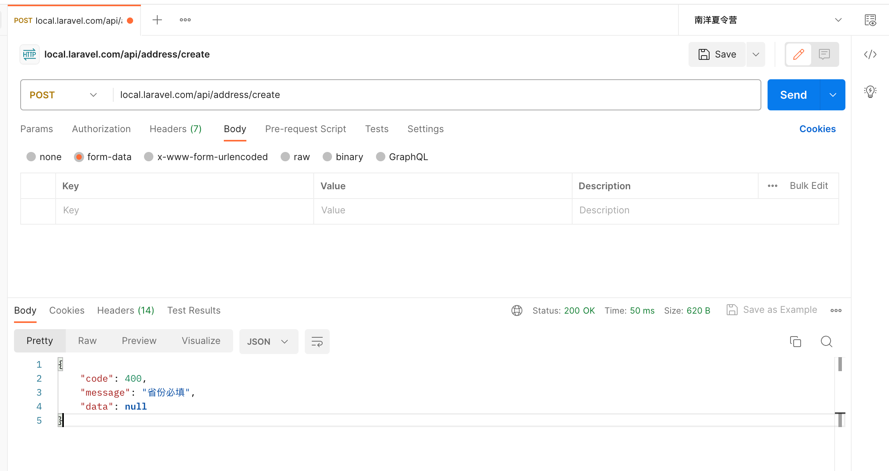

# PHP Validate

[](LICENSE)
[](https://www.php.net/ChangeLog-5.php#PHP_5_6)

[](https://coveralls.io/github/GuiRong2969/laravel-validate?branch=master)


`Laravel` 验证器以及验证场景的使用。

- 在laravel内置的验证器基础上，扩展了验证场景
- 解决 `FormRequest` 验证表单文件过多的问题


## 项目地址

- **github** <https://github.com/GuiRong2969/laravel-validate.git>

> **注意：** 
-  版本要求 `php >= 5.6.0`
## 安装

```bash
composer require guirong/laravel-validate
```

## 使用

- 以地址簿的 新增，编辑，删除 功能演示

创建地址簿验证器 `\App\Http\Requests\AddressRequest`

```bash
php artisan make:request AddressRequest
```

***`AddressRequest` 验证器：***

写入内容

```php

namespace App\Http\Requests;

use Guirong\Laravel\Validate\FormRequest;

class AddressRequest extends FormRequest
{
    /**
     * Auto validation
     *
     * @var boolean
     */
    protected $autoValidate = true;

    /**
     * Strictly verify scene
     * 自动校验时，严格验证场景`scene`是否存在；设置 false 表示场景不存在的情况下校验所有规则
     *
     * @var boolean
     */
    protected $sceneStrict = true;

    /**
     * Determine if the user is authorized to make this request.
     *
     * @return bool
     */
    public function authorize()
    {
        return true;
    }

    /**
     * Get the validation rules that apply to the request.
     *
     * @return array
     */
    public function rules()
    {
        return [
            'id' => 'required',
            'province' => 'required',
            'city' => 'required',
            'county' => 'required',
            'address' => 'required',
        ];
    }

    /**
     * Get the validation messages that apply to the request.
     *
     * @return array
     */ 
    public function messages(){
        return [
            'id.required' => 'id必填',
            'province.required' => '省份必填',
            'city.required' => '城市必填',
            'county.required' => '区县必填',
            'address.required' => '详细地址必填',
        ];
    }

    /**
     * 定义场景规则
     *
     * @return array
     */
    public function scene()
    {
        return [
            // 地址新增时，校验以下字段
            'create' => [
                'province', 'city', 'county', 'address'
            ],

            // 地址编辑时，校验以下字段
            'update' => [
                'id', 'province', 'city', 'county', 'address'
            ],

            // 地址删除时，校验以下字段
            'delete' => [
                'id'
            ],
        ];
    }
}

```

## 接下来在控制器内使用 

创建地址簿控制器 `\App\Http\Controllers\AddressController`

```bash
php artisan make:controller AddressController
```

***`AddressController` 控制器：***

```php

namespace App\Http\Controllers;

use Illuminate\Http\Request;

class AddressController extends Controller
{
    
}
```

***验证器的调用方式有三种，分别以地址簿的 `新增，编辑，删除` 三种场景演示：***

***`新增`：***

> 控制器`AddressController` 的`create`方法注入依赖时，自动绑定验证器`AddressRequest`中的同名 `create` 场景进行校验

```php

namespace App\Http\Controllers;

use Illuminate\Http\Request;

class AddressController extends Controller
{
    public function create(AddressRequest $request)
    {
        // ...校验通过后处理业务 
    }

}
```

***`编辑`：***
> 控制器`AddressController` 的 `edit` 方法中，指定验证器`AddressRequest`中的 `update` 场景进行校验

```php

namespace App\Http\Controllers;

use Illuminate\Http\Request;

class AddressController extends Controller
{
    public function edit(AddressRequest $request)
    {
        $request->validate('update');

        // 或者
        // $request->setScene('update')->validate();

        // ...校验通过后处理业务 
    }

}
```

验证器`AddressRequest` 关闭自动校验， `autoValidate` 修改为 false，

> 注意：关闭自动校验后，`新增`中的函数场景自动绑定和 `删除` 中的路由场景绑定将会失效

```php
namespace App\Http\Requests;

use Guirong\Laravel\Validate\FormRequest;

class AddressRequest extends FormRequest
{
    /**
     * Auto validation
     *
     * @var boolean
     */
    protected $autoValidate = false;

}
```

***`删除`：***
> 定义路由，指定校验场景为 `delete` , 在控制器`AddressController` 的`del`方法注入依赖时，将自动绑定验证器`AddressRequest`中的 `delete` 场景进行校验

```php

namespace App\Http\Controllers;

use Illuminate\Http\Request;

class AddressController extends Controller
{
    public function del(AddressRequest $request)
    {
        // ...校验通过后处理业务 
    }

}
```

在 `app\Providers\AppServiceProvider.php` boot 下面添加 `scene(场景方法)`

```php
    /**
     * Bootstrap any application services.
     *
     * @return void
     */
    public function boot()
    {
        // Route 路由自定义scene(场景方法)
        \Illuminate\Routing\Route::macro('scene', function ($scene = null) {
            $action = \Illuminate\Routing\Route::getAction();
            $action['_scene'] = $scene;
            \Illuminate\Routing\Route::setAction($action);
        });
    }
```

来看看这里的路由怎么写的吧

```php
// 这里我们使用的验证场景是 delete
Route::post('/address/del', [\App\Http\Controllers\AddressController::class, 'del'])->scene('delete');

```

### 添加路由

在 `route\api.php` 内添加

```php

Route::post('/address/create', [\App\Http\Controllers\AddressController::class, 'create']);

Route::post('/address/edit', [\App\Http\Controllers\AddressController::class, 'edit']);

Route::post('/address/del', [\App\Http\Controllers\AddressController::class, 'del'])->scene('delete');

```

## 自定义验证规则
### 方法1、遵循laravel框架内置能力，使用扩展
注册自定义验证规则的方式是使用 Validator 门面上的 extend 方法。我们在某个服务提供者（如 AppServiceProvider）中使用该方法注册一个自定义验证规则：
```php
<?php

namespace App\Providers;

use Illuminate\Support\ServiceProvider;
use Illuminate\Support\Facades\Validator;

class AppServiceProvider extends ServiceProvider
{
    /**
     * 启动应用服务
     *
     * @return void
     */
    public function boot()
    {
        Validator::extend('cityEnable', function($attribute, $value, $parameters, $validator) {
            return $value == '杭州市';
        });
    }

    /**
     * 注册服务提供者
     *
     * @return void
     */
    public function register()
    {
        //
    }
}
```
自定义验证器闭包接收四个参数：要验证的属性名称、属性值、传递给规则的参数数组以及 Validator 实例。

在 `\App\Http\Requests\AddressResuest` 验证器内使用
```php

    /**
     * Get the validation rules that apply to the request.
     *
     * @return array
     */
    public function rules()
    {
        return [
            'id' => 'required',
            'province' => 'required',
            'city' => 'required|cityEnable',    //校验城市必须是杭州
            'county' => 'required',
            'address' => 'required',
        ];
    }

    /**
     * Get the validation messages that apply to the request.
     *
     * @return array
     */ 
    public function messages()
    {
        return [
            'id.required' => 'id必填',
            'province.required' => '省份必填',
            'city.required' => '城市必填',
            'city.city_enable' => '城市必须是杭州市',   //提示信息
            'county.required' => '区县必填',
            'address.required' => '详细地址必填',
        ];
    }
```

### 方法2、基于laravel框架内置能力，扩展自定义的验证函数 validate{Method}
扩展自定义验证规则的方式是使用 Validator 验证器上的 addExtension 方法。我们通过引入 `CustomExtensionsTrait` 特性中的 `addCustomExtensions` 函数，可在 Validator 验证器内部自动加载自定义验证函数，自定义验证函数命名须符合 `validate{Method}` 格式，并返回一个闭包

```php

namespace App\Http\Requests;

use Guirong\Laravel\Validate\FormRequest;

class AddressRequest extends FormRequest
{
    //引入自定义扩展加载特性
    use \Guirong\Laravel\Validate\Traits\CustomExtensionsTrait; 

    // ..........省略代码..........


    /**
     * Get the validation rules that apply to the request.
     *
     * @return array
     */
    public function rules()
    {
        return [
            'id' => 'required',
            'province' => 'required',
            'city' => 'required|cityEnable',    //校验城市必须是杭州，将通过当前类内部定义的`validateCityEnable`函数加载验证规则
            'county' => 'required',
            'address' => 'required',
        ];
    }

    /**
     * Get the validation messages that apply to the request.
     *
     * @return array
     */ 
    public function messages()
    {
        return [
            'id.required' => 'id必填',
            'province.required' => '省份必填',
            'city.required' => '城市必填',
            'city.city_enable' => '城市必须是杭州市',   //提示信息
            'county.required' => '区县必填',
            'address.required' => '详细地址必填',
        ];
    }

    /**
     * Custom rule of cityEnable
     * 
     * @return Closure
     */
    public function validateCityEnable()
    {
        return function ($attribute, $value, $parameters, $validator) {
            return $value == '杭州市';
        };
    }

}
```

## 测试
- 新增


- 编辑


- 删除


- 自定义验证规则

## 结语
> *本文的 `scene` 验证场景只是为了灵活适应业务的写法，laravel内置的 `FormRequest` 表单才是最灵活的写法但容易造成类泛滥，感兴趣的话可以自己任意扩展。*

## License

[MIT](LICENSE)


## 我的其他项目

### `guirong/cli-message` [github](https://github.com/GuiRong2969/cli-message)

一个简单易用的，命令行输出样式工具库

### `guirong/php-router` [github](https://github.com/GuiRong2969/php-router)
 
轻量且快速的路由库

### `guirong/php-closure` [github](https://github.com/GuiRong2969/php-closure)

闭包的序列化和反序列化类库

### `guirong/php-validate` [github](https://github.com/GuiRong2969/php-validate)

一个轻量级且功能丰富的验证和过滤库

### `guirong/php-event` [github](https://github.com/GuiRong2969/php-event)

一个简洁小巧的php事件监听器

### `guirong/php-shell` [github](https://github.com/GuiRong2969/php-shell)

一个基于`psysh shell`的命令行交互模式依赖包